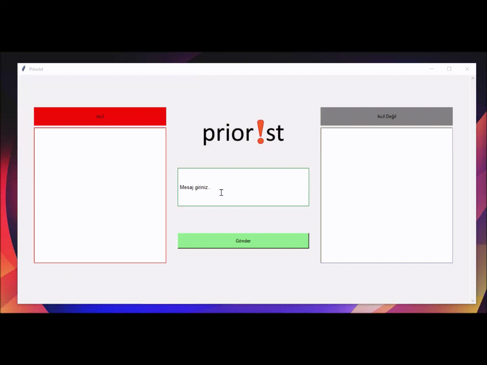
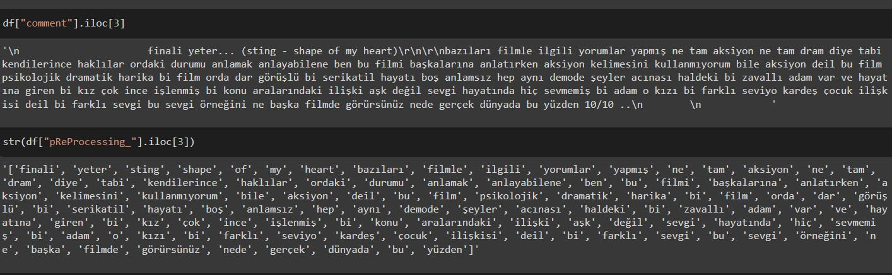
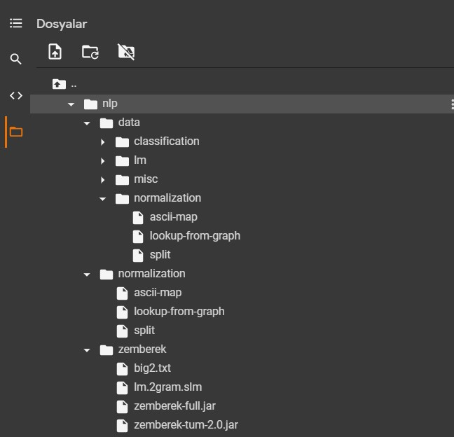
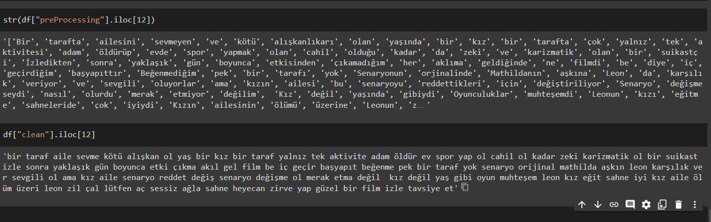
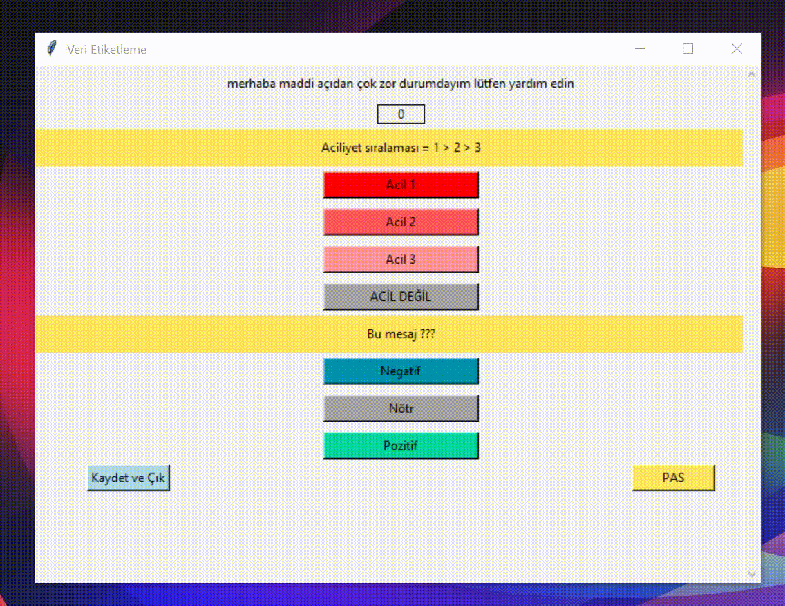
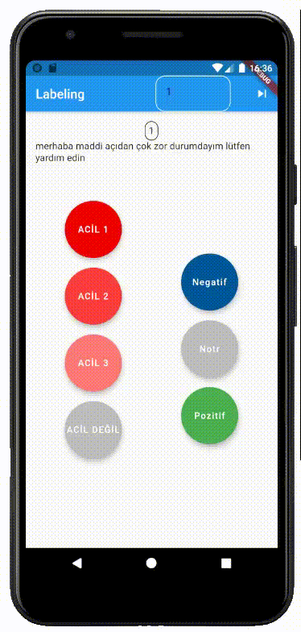
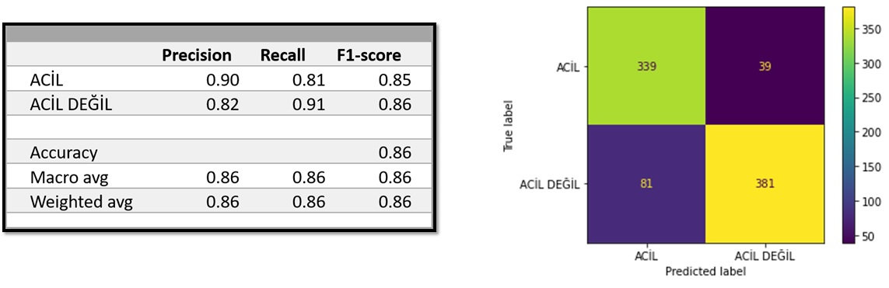
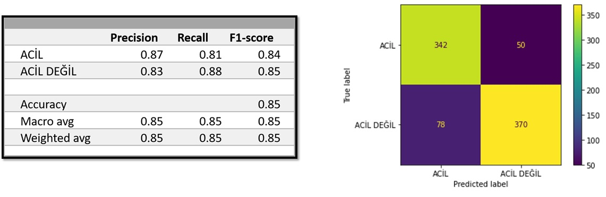
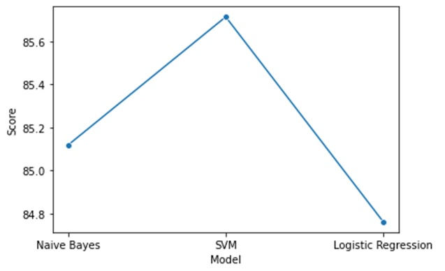

# NLP- Aciliyet Sınıflandırması

### Proje Tanıtım Videosu'na [buradan](https://drive.google.com/file/d/1QTmIMObfebqSB4Mcjw6EhrYn3f6dggVu/view?usp=sharing) ulaşabilirsiniz

## Priorist Nedir?
Gelen tüm mesajları "Acil" ve "Acil Değil" olarak sınıflandırarak tehlike veya önem içeren mesajları ön plana çıkarıp hızlıca fark edilmesini sağlar.

  

Not: Bu repository içerisindeki tüm mesajlar örnek teşkil etmesi amacıyla ekibimiz tarafından gerçek mesajlara benzer şekilde oluşturulmuştur.

## PreProcessing
Her bir satır aşağıdaki gibi noktalama işaretlerinden, özel karakterlerden temizlendi ve varsa link, mail adresi gibi bağlantılar kaldırıldı.  

## Zemberek
Java ile yazılmış türkçe nlp kütüphanesi olan Zemberek bilgisayarımızdaki JVM(java virtual machine) çalıştırarak ve gerekli dosyaları import edilerek kullanıldı. Bu doslayarı [buradaki linkte](https://drive.google.com/drive/folders/1nvc9FQyHQjGDNj85UgWeGSFhL1b8W4dd?usp=sharing) bulabilirsiniz.
Dosyaların görünümü şu şekilde:

                           
Zemberek java kodu içerisindeki TurkishMorphology, TurkishSpellChecker, TurkishSentenceNormalizer classlarının methodları kullanıldı.
Zemberek sonucundaki çıktı:   
      
       

## Labeling
Datayı etiketleme aşamasında kullanabilmek için desktop/mobile olarak geliştirdiğimiz 2 uygulama.

  

## ML Model Results
### Naive Bayes

### SVM

### Logistic Regression 

#### Comparison 

Geliştirilen üç farklı model ile ortalama %85 doğruluk puanı (Accuracy score) elde edilmiştir.

